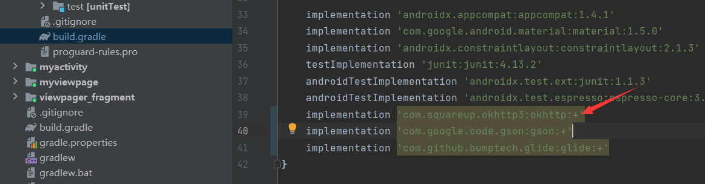
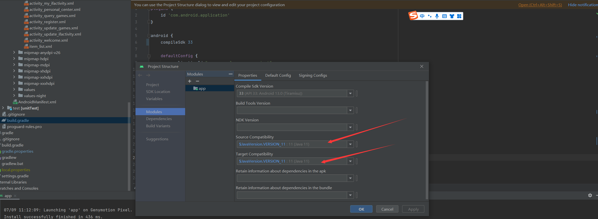

# android_study
android 学习相关  

学习参考文档：  
+ [google官方文档](https://developer.android.google.cn/develop/ui/views/layout/declaring-layout)

## 第一天
### 环境配置
1. 配置`GRADLE_USER_HOME`，防止因`.gradle`过大而导致c盘爆满
### 配置代理
1. Settings --> System Settings --> HTTP Proxy 
2. 代理地址
    + 中国科学院开源协会镜像站地址:
        + http://mirrors.opencas.cn 端口：80
        + http://mirrors.opencas.org 端口：80
        + http://mirrors.opencas.ac.cn 端口：80
    + 上海GDG镜像服务器地址:
        + http://sdk.gdgshanghai.com 端口：8000
    + 北京化工大学镜像服务器地址:
        + http://ubuntu.buct.edu.cn/ 端口：80
        + http://ubuntu.buct.cn/ 端口：80 
        + http://ubuntu.buct6.edu.cn/ 端口：80
    + 大连东软信息学院镜像服务器地址: http://mirrors.neusoft.edu.cn 端口：80
    + 腾讯Bugly 镜像: http://android-mirror.bugly.qq.com 端口：8080
3. 觉得as默认的模拟器比较慢的话，可以配置`Genymotion`，[参考链接](https://blog.csdn.net/weixin_44871749/article/details/126044145)
### 单位和尺寸

dp(dip): device independent pixels(设备独立像素)，不依赖像素
sp: scaled(放大像素) 主要用于字体显示
ppi：每英寸像素数（pixel per inch），该值越高，则屏幕越细腻。
dpi：每英寸多少点（dot per inch），该值越高，则图片越细腻

### Activity
Android中，Activity是所有程序的根本，所有程序的流程都运行在Activity之中，如果把手机比作一个浏览器，那么Activity就相当于一个网页

### res的目录识别
+ drawable 存放能转换为绘制资源的位图文件或定义了绘制资源的xml文件。
+ layout 存放定义了用户界面布局的xml文件。
+ mipmap-hdpi 高分辨率图标目录。
+ mipmap-mdpi 中等分辨率图标目录，一般较少使用，除了兼容老旧手机。
+ mipmap-xhdpi 超高分辨率目录。
+ mipmap-xxhdpi 超超高分辨率目录，当前主流手机的分辨率。
+ mipmap-xxxhdpi 超超超高分辨率目录，如平板电视。
+ values
  存放定义了多种类型资源的xml文件，主要包括以下这些：
    + demens.xml：定义尺寸资源
    + string.xml：定义字符串资源
    + styles.xml：定义样式资源
    + colors.xml：定义颜色资源
    + arrays.xml：定义数组资源
    + attrs.xml：自定义控件时用的较多，自定义控件的属性。
  除了上述这些，可能还会涉及到以下目录：
+ menu 存放定义了菜单资源的xml文件。
+ raw 存放各种原生资源(音频、视频、一些XML文件等)。
+ anim 存放补间动画的XML文件
## 第二天
### 常见界面布局
1. **View**  
在Android中View类是最基本的一个UI类，基本上所有的高级UI组件都是继承View类实现的。Android应用的绝大部分UI组件都放在android.widget包及其子包、android.view包及其子包中，可以看到Android应用的所有UI组件都继承了 View类。View类是Android系统平台上用户界面表示的基本单元，View的一些子类被统称为Widgets （工具），提供了诸如文本输入框和按钮之类的UI对象的完整实现
所有的UI元素都是通过`View`与`ViewGroup`构建的，对于一个`Android`应用的用户界面来说，`ViewGroup`作为容器盛装界面中的控件，它可以包含普通的`View`控件，也可以包含`ViewGroup`
2. **界面布局编写方式**  
    1. 在xml中编写布局（推荐）
        + 数据视图分离，使程序结构更加清晰
    2. 在Java中编写
        + 在`Android`中所有的布局和控件都可以通过`new`关键字创建出来，将创建出来的`View`控件添加到`ViewGroup`布局中，从而实现`View`控件在布局中显示
3. **代码示例**  
    1. 使用`xml`编写
        1. 在`res/layout`目录下添加`xml`
            ```xml
            <?xml version="1.0" encoding="utf-8"?>
            <LinearLayout xmlns:android="http://schemas.android.com/apk/res/android"
                          android:layout_width="match_parent"
                          android:layout_height="match_parent"
                          android:orientation="vertical" >
                <TextView android:id="@+id/text"
                          android:layout_width="wrap_content"
                          android:layout_height="wrap_content"
                          android:text="Hello, I am a TextView" />
            </LinearLayout>
            ```
        2. 在`MainActivity`中添加与上述`xml`的绑定
            ```java
            public void onCreate(Bundle savedInstanceState) {
                super.onCreate(savedInstanceState);
                // 通过 R.layout 来绑定xml
                setContentView(R.layout.main_layout);
            }
            ```
    2. 使用`java`编写
    ```java
    public class MainActivity extends AppCompatActivity {  
        @Override
        protected void onCreate(Bundle savedInstanceState){
            super.onCreate(savedInstanceState);
            //setContentView(R.layout.activity_main);
            // 创建一个线性布局
            LinearLayout layout = new LinearLayout (this);
            layout.setOrientation(LinearLayout.VERTICAL);   
            // 创建一个显示Hello World!的TextView
            TextView show = new TextView(this);
            show.setText("Hello World!");
            // 向layout容器添加一个TextView
            layout.addView(show);
            // 设置该Activity显示layout
            setContentView(layout);
        }
    }
    ```
4. 常见布局
    1. 线性布局，特点：以水平或垂直方向排列
        1. LinearLayout线性布局
        线性布局（LinearLayout）主要以水平或垂直方式来显示界面中的控件。当控件水平排列时，显示顺序依次为从左到右，当控件垂直排列时，显示顺序依次为从上到下
        2. orientation属性
        orientation属性控制控件排列方向，包含两个属性值：vertical(垂直)、horizontal(水平)；weight属性表示权重，类似与`flex`中的`flex-grow`,`flex-shrink`的概念
    2. 相对布局，特点：通过相对定位排列
        1. 相对布局（RelativeLayout）是通过相对定位的方式指定子控件位置，即以其它控件或父容器为参照物，摆放控件位置
        2. 相对布局—控件位置属性
        | 布局属性                         | 功能描述                             |
        | ------------------------------  | ------------------------------------ |
        | android:layout_centerInparent   | 设置当前控件位于父布局的中央位置        |
        | android:layout_centerVertical   | 设置当前控件位于父布局的垂直居中位置    |
        | android:layout_centerHorizontal | 设置当前控件位于父布局的水平居中位置    |
        | android:alignParentTop          | 设置当前控件是否与父控件顶端对齐        |
        | android:alignParentLeft         | 设置当前控件是否与父控件左对齐         |
        | android:alignParentRight        | 设置当前控件是否与父控件右对齐         |
        | android:alignParentBottom       | 设置当前控件是否与父控件底部对齐        |
        | android:above                   | 设置当前控件位于某控件的上方            |
        | android:below                   | 设置当前控件位于某控件的下方            |
        | android:toLeftOf                | 设置当前控件位于某控件的左侧            |
        | android:toRightOf               | 设置当前控件位于某控件的右侧            |
    3. 网格布局，`GridLayout`类似于前端中的`Grid`
    4. 帧布局，特点：开辟空白区域，帧里面的控件会叠加
    5. 表格布局，特点：表格形式排列
    6. 约束布局，特点：可视化编写布局

### 常见界面控件

#### TextView
1. 功能： 用于显示文本信息
2. 控件属性及功能描述  

| 控件属性               | 功能描述            |
| ---------------------  | ------------------ |
| android:id             | id                 |
| android:layout_width   | 控件宽度            |
| android:layout_height  | 控件高度            |
| android:layout_margin  | margin              |
| android:layout_padding | padding             |
| android:text           | 文本                |
| android:textColor      | 文本颜色             |
| android:textSize       | 文本大小，推荐单位sp  |
| android:gravity        | 设置文本内容的位置    |
| android:maxLength      | 文本最大长度，超出隐藏 |
| android:lines          | 文本行数，超出隐藏     |
| android:maxLines       | 文本最大行数，超出隐藏 |
| android:ellipsize      | 文本超出范围的显示方式 `start`,`middle`,`end`,`marquee`,通常与`android:singleline = "true"`搭配 |

#### Button
1. 功能：表示按钮，它继承自`TextView`控件，既可以显示文本，又可以显示图片，同时也允许用户通过点击来执行操作，当`Button`控件被点击时，被按下与弹起的背景会有一个动态的切换效果，这个效果就是点击效果
2. 实现点击事件
    + **在布局文件中**  
        1. 在`layout`中指定`onClick`属性
        ```xml
        android:onClick="click"
        ```
        2. 在`Activity`中实现方法
        ```java
        public void click(View v){
          Log.e("xml中的click方法", "onClick")
        }
        ```
    + **在`Activity`中**
        ```java
        Button btn = (Button) findViewById(R.id.btn);
        btn.setOnClickListener((View view)->{
          Log.e("内部类方式，前提是要在xml中提前写好id","onClick")
        })
        ```
#### EditView
1. 功能：它继承自`TextView`控件，用户可在此控件中输入信息，类似`input`
2. 控件属性及功能描述
| 控件属性                     | 功能描述                |
| --------------------------- | ----------------------- |
| android:editable            | 是否可编辑  disabled     |
| android:phoneNumber         | 类型为数字时的显示        |
| android:password            | 类型为密码时的显示        |
| android:scrollHorizontally  | 超出宽度时是否会出现横拉条 |
| android:hint                | placeholder             |
| android:textColorHint       | placeholder color       |

#### ImageView
1. 功能：可以加载各种图片资源
2. 控件属性及功能描述
| 控件属性                     | 功能描述                |
| --------------------------- | ----------------------- |
| android:background          | 背景，可以设置为图片     |
| android:src                 | src                    |
| android:scaleType           | 图片资源的缩放或移动     |
3. 代码示例
```xml
<ImageView
  android:layout_width="wrap_content"
  android:layout_height="wrap_content"
  android:background="@drawable/bg"
/>
<ImageView
  android:layout_width="100dp"
  android:layout_height="100dp"
  android:src="@drawable/bg"
/>
```
#### RadioButton
1. 功能：`RadioButton`为单选按钮，`android:checked`属性指定是否选中的状态。`RadioGroup`是单选组合框，可容纳多个`RadioButton`，并把它们组合在一起，实现单选状态
2. 代码示例
```xml
<RadioGroup
  android:layout_width="match_parent"
  android:layout_height="wrap_content"
  android:orientation="vertical">
  <RadioButton
    android:layout_width="wrap_content"
    android:layout_height="wrap_content"
    android:textSize="25sp"
    android:text="男" />
  <RadioButton
    android:layout_width="wrap_content"
    android:layout_height="wrap_content"
    android:textSize="25sp"
    android:text="女" />
</RadioGroup>
```
#### CheckBox
1. 功能: `CheckBox`表示复选框，它是`Button`的子类，用于实现多选功能，通过`android:checked`属性指定`CheckBox`控件是否选中的状态
2. 代码示例
```xml
<CheckBox
  android:layout_width="wrap_content"
  android:layout_height="wrap_content"
  android:text="羽毛球"
  android:textSize="18sp"/>
<CheckBox
  android:layout_width="wrap_content"
  android:layout_height="wrap_content"
  android:text="乒乓球"
  android:textSize="18sp"/>
```
#### Toast
1. 功能: `Toast`是`Android`系统提供的轻量级信息提醒机制，用于向用户提示即时消息，它显示在应用程序界面的最上层，显示一段时间后自动消失不会打断当前操作，也不获得焦点
2. 代码示例
```java
Toast.makeText(MainActivity.this,"WIFI已断开",Toast.LENGTH_SHORT).show();
```
## 第三天

### Fragment
#### 什么是 Fragment?（类似于前端中的组件化的概念）
1. 具备生命周期，子activity
2. 必须委托在activity中才能运行
#### 如何创建并运行
##### 静态加载

1. 创建；直接在`java`目录下，通过`android studio`创建一个`fragment`,`layout`目录下会同样生成一个对应的`xml`
2. 修改：
```java
    public class BlankFragment1 extends Fragment {
        private View     root;
        private TextView textView;
        private Button   button;
        @Override
        public void onCreate(Bundle savedInstanceState) {
            super.onCreate(savedInstanceState);
        }
        /**
        * 创建视图
        */
        @Override
        public View onCreateView(LayoutInflater inflater, ViewGroup container,
                                Bundle savedInstanceState) {
            if (root == null) {
                root = inflater.inflate(R.layout.fragment_blank1, container, false);
            }
            textView = root.findViewById(R.id.textview);
            button = root.findViewById(R.id.btn);
            button.setOnClickListener((View view) -> {
                textView.setText("点击修改");
            });
            return root;
        }
    }
```

```xml
<?xml version="1.0" encoding="utf-8"?>
<!-- 切记要修改为 LinearLayout，否则里面的组件都会挤在左上角 -->
<LinearLayout xmlns:android="http://schemas.android.com/apk/res/android"
    xmlns:tools="http://schemas.android.com/tools"
    android:layout_width="match_parent"
    android:layout_height="match_parent"
    tools:context=".BlankFragment1"
    android:orientation="vertical">

    <TextView
        android:layout_width="match_parent"
        android:layout_height="80dp"
        android:text="@string/hello_blank_fragment"
        android:id="@+id/textview" />

    <Button
        android:layout_width="match_parent"
        android:layout_height="wrap_content"
        android:text="按钮"
        android:id="@+id/btn" />
</LinearLayout>
```
3. 挂载：因Fragment创建完成后并不能单独使用，所以需要在`activity_main.xml`中挂载之后才可显示
```xml
<?xml version="1.0" encoding="utf-8"?>
<LinearLayout android:layout_width="match_parent"
    android:layout_height="match_parent"
    xmlns:android="http://schemas.android.com/apk/res/android">

    <fragment
        android:name="com.example.myfragment.BlankFragment1"
        android:layout_width="match_parent"
        android:layout_height="match_parent"
        android:id="@+id/fragment1" />
</LinearLayout>
```
4. 注意事项： `fragment`必须添加id，否则会启动失败，报如下错误
```
This <fragment> tag should specify an id or a tag to preserve state across activity restarts
```
##### 动态加载
*在布局文件中添加Fragment的方法，非常简单，但是有一个缺点，那就是一旦添加就不能在运行时将其删除*  
挂载：在`activity_main.xml`中使用`FrameLayout`存放Fragment
```xml
<?xml version="1.0" encoding="utf-8"?>
<LinearLayout 
    xmlns:android="http://schemas.android.com/apk/res/android"
    android:layout_width="match_parent"
    android:layout_height="match_parent"
    android:orientation="vertical"
>
    <FrameLayout 
        android:id="@+id/fragment_container"
        android:layout_width="match_parent"
        android:layout_height="wrap_content"
    />
</LinearLayout>
```
*然后在Activity中，通过代码将Fragment添加进Activity中。动态添加Fragment主要分为5步：*
1. 创建一个待处理的`fragment`
2. 获取`FragmentManager`，一般都是通过`getSupportFragmentManager()`
3. 开启一个事务，通过调用beginTransaction方法开启。
4. 使用`transaction`进行`fragment`的替换，一般使用add或者replace方法实现，需要传入容器的id和Fragment的实例。
5. 提交事务，调用commit方法提交。
```java
package com.example.dynamicfragment;

import androidx.appcompat.app.AppCompatActivity;
import androidx.fragment.app.Fragment;
import androidx.fragment.app.FragmentManager;
import androidx.fragment.app.FragmentTransaction;

import android.os.Bundle;
import android.view.View;
import android.widget.Button;

public class MainActivity extends AppCompatActivity implements View.OnClickListener {

    @Override
    protected void onCreate(Bundle savedInstanceState) {
        super.onCreate(savedInstanceState);
        setContentView(R.layout.activity_main);
        Button btn1 = findViewById(R.id.btn);
        btn1.setOnClickListener(this);
        Button btn2 = findViewById(R.id.btn1);
        btn2.setOnClickListener(this);
    }
    @Override
    public void onClick(View v) {
        if(v.getId() == R.id.btn){
            replaceFragment(new BlankFragment1());
        }else {
            replaceFragment(new BlankFragment2());
        }
    }
    private void replaceFragment(Fragment fragment) {
        FragmentManager fragmentManager = getSupportFragmentManager();
//        开始事务
        FragmentTransaction fragmentTransaction = fragmentManager.beginTransaction();
//        替换当前ui
        fragmentTransaction.replace(R.id.frameLayout, fragment);
//        添加到路由栈，类似与history与组件之间的关联
        fragmentTransaction.addToBackStack(null);
//        提交事务
        fragmentTransaction.commit();
    }
}
```
#### 生命周期vsActivity的生命周期

##### Activity的生命周期
1. Created
2. Started
3. Resumed
4. Paused
5. Stopped
6. Destroyed

##### Fragment的生命周期
###### Created
1. `onAttach`: 与`Activity`绑定，因为Fragment创建完成后并不能单独使用
2. `onCreate`：创建，通常做`bundle`相关的操作
3. `onCreateView`: 对ui进行操作
4. `onActivityCreated`：`Activity`已经创建
###### onStart
###### onResume
###### onPause
###### onStop
###### Destroyed
1. `onDestroyView`
2. `onDestroy`：销毁
3. `onDetach`

##### 生命周期顺序

1. 打开界面
onCreate -> onCreateView -> onActivityCreated -> onStart -> onResume
2. 按下主屏键
onPause -> onStop
3. 重新打开界面
onStart -> onResume
4. 按后退键
onPause -> onStop -> onDestroyView -> onDestroy -> onDetach

#### 与viewpage结合
[代码详见](https://github.com/P4X666/android_demo/tree/master/viewpager_fragment)

### Activity
Activity是Android组件中最基本也是最常用的一种组件，在一个Android应用中，一个Activity通常就是一个单独的屏幕
#### 创建、注册和销毁
一般创建Activity的步骤总结如下：
1. 定义一个类继承自 android.app.Activity或者其子类。
2. 在res/layout目录中创建一个xml文件，用于创建 Activity的布局。
3. 在 AndroidManifest.xml 文件中注册所创建的 Activity。
4. 重写 Activity的 onCreate()方法，并在该方法中使用 setContentView()加载指定的布局文件。
代码如下
```java
public class FirstActivity extends AppcompatActivity{
    protected void onCreate(Bundle savedInstanceStatus){
        super.onCreate(saveInstanceState);
        setContentView(R.id.first)
    }
}
```
**需要注意的是setContentView()方法既可以接收布局文件对应的资源id为参数，也可以接收View对象为参数**
5. 所有的活动都要再```AndroidManifest.xml```中进行注册才能生效
```xml
<?xml version="1.0" encoding="utf-8"?>
<manifest xmlns:android="http://schemas.android.com/apk/res/android">
    <!-- 网络权限 -->
    <uses-permission android:name="android.permission.INTERNET" /> <!-- 相机权限 -->
    <uses-permission android:name="android.permission.CAMERA" /> <!-- 文件写权限 -->
    <uses-permission android:name="android.permission.WRITE_EXTERNAL_STORAGE" /> <!-- 如果未在 <uses-feature> 声明中将 android:required 设置为 false，则 Android 会假定应用必须在有该硬件的情况下才能运行。因此，系统会阻止某些设备安装应用 -->
    <!-- uses-feature，只是起到指示性的作用，不是强制的检测 -->
    <!-- 摄像头 -->
    <uses-feature android:name="android.hardware.camera" />

    <application
        android:name=".app.MyApplication"
        android:allowBackup="true"
        android:icon="@mipmap/ic_launcher"
        android:label="@string/app_name"
        android:roundIcon="@mipmap/ic_launcher_round"
        android:supportsRtl="true"
        android:theme="@style/Theme.Demo"
        android:usesCleartextTraffic="true"> // 允许应用请求http，android默认只能请求https
        <activity
            android:name=".activity.ServiceActivity"
            android:exported="false" />
        <!-- 主应用 -->
        <activity
            android:name=".activity.SplashActivity"
            android:exported="true">
            <intent-filter>
                <action android:name="android.intent.action.MAIN" />

                <category android:name="android.intent.category.LAUNCHER" />
            </intent-filter>
        </activity>
    </application>
</manifest>
```
可以看到，Activity的注册声明要放在标签内，这里通过标签来对活动进行注册的。
不过，仅仅注册活动仍然不行，因为需要为程序配置主活动：在标签内部加入`<intent - filter>`标签  

6. 销毁就比较简单了，直接在`activity`中调用`finish()`即可，效果和按下Back键是一样的

### 数据传递
#### SharedPreferences  
`SharedPreferences`用来进程间共享数据，它只能存储简单数据类型（int、boolean、String 等），
复杂数据类型建议使用文件、数据库等其他方式存储   
存数据
```java
    SharedPreferences sp = getSharedPreferences("data", MODE_PRIVATE);
    SharedPreferences.Editor editor = sp.edit();
    editor.putString("name", "lala");
    editor.putInt("age", 18);
    editor.putBoolean("man", true);
    editor.apply();
```
取数据
```java
    SharedPreferences sp = getSharedPreferences("data", MODE_PRIVATE);
    String name = sp.getString("name", "aaa");
    int age = sp.getInt("age", 0);
    boolean man = sp.getBoolean("man", false);
```
清除数据
```java
    SharedPreferences sp = getSharedPreferences("data", MODE_PRIVATE);
    SharedPreferences.Editor editor = sp.edit();
    editor.clear();
```
1. 上面用到的是Context类的getSharedPreferences()方法，需要传入文件名和操作模式，默认为0也就是MODE_PRIVATE。  
获取SharedPreferences还有两种方法：Activity类的getPreferences()方法，和PreferenceManager类的静态方法getDefaultSharedPreferences()。前者会自动将当前类名作为文件名，只需要传入操作模式。后者需传入context，并自动使用包名作为前缀来命名SharedPreferences文件。

2.提交SharedPreferences数据时，可以用SharedPreferences.Editor的commit()方法，也 可以用它的apply()方法。两者有什么区别呢，下面的解释来自《阿里巴巴Android开发手册》：
```code
SharedPreference 提交数据时，尽量使用Editor#apply()，而非Editor#commit()。一般来讲，仅当需要确定提交结果，并据此有后续操作时，才使用 Editor#commit()。
```
说明
```code
SharedPreference 相关修改使用 apply 方法进行提交会先写入内存，然后异步写入磁盘，commit
方法是直接写入磁盘。如果频繁操作的话 apply 的性能会优于 commit，apply会将最后修改内容写入磁盘。
但是如果希望立刻获取存储操作的结果，并据此做相应的其他操作，应当使用 commit。
```
#### Intent的Bundle
第一个Activity存
```java
//创建意图对象
 Intent intent = new Intent(MainActivity.this,TwoActivity.class);
 //用数据捆传递数据
 Bundle bundle = new Bundle();
 bundle.putString("data", str);
 //把数据捆设置改意图
 intent.putExtra("bun", bundle);
 //激活意图
 startActivity(intent);
```
第二个取

```java
//获取Bundle
 Intent intent = getIntent();
 Bundle bundle = intent.getBundleExtra("bun");
 String str = bundle.getString("data");
 tv.setText(str);
```
#### Intent的putExtra
第一个Activity存
```java
//创建意图对象
 Intent intent = new Intent(this,TwoActivity.class);
 //设置传递键值对
 intent.putExtra("data",str);
 //激活意图
 startActivity(intent);
```
第二个取

```java
// 获取意图对象
 Intent intent = getIntent();
 //获取传递的值
 String str = intent.getStringExtra("data");
 //设置值
 tv.setText(str);
```

### startActivity，startActivityForResult和registerForActivityResult的异同
相同点是它们都可以从当前`Activity`直接跳转到另一个`Activity`
1. startActivity
```java
// 直接跳转到另一个Activity，只做跳转
startActivity(new Intent(CurrentActivity.this, NextActivity.class));
```
2. `startActivityForResult`(已废弃)
当我们需要跳转到另一个Activity并需要拿到返回结果时，可以使用startActivityForResult()来实现，不过现已废弃，
下面使用`registerForActivityResult`来代替
3. `registerForActivityResult`
使用Intent在activity（fragment）间通信，返回ActivityResult  
* *
```java
private ActivityResultLauncher<Intent> activityResultLauncher;
...
// 在onCreate或onAttach中完成初始化
activityResultLauncher = registerForActivityResult(new ActivityResultContracts.StartActivityForResult(), result -> {
            Intent data = result.getData();
            if (data != null) {
                // 数据处理
            }
        });
// 启动代码，在合适的地方调用即可
activityResultLauncher.launch(Intent intent);
```

## 注意事项
1. 依赖后面改为`+`会默认使用最新的依赖，后续如果换人接手或接手老项目会导致项目启动报错，报错通常如下，
建议显式使用依赖
```bash
avoid using + in version numbers can lead to unpredictable and unrepeatable builds
```


2. 在下载别人的项目后，尽可能的不要去动依赖的版本，比如之前用的是`java8`，升级之后依赖会到`java11`，容易出现下列报错
```java
An exception occurred applying plugin request [id: 'com.android.application']
> Failed to apply plugin 'com.android.internal.application'.
   > Android Gradle plugin requires Java 11 to run. You are currently using Java 1.8.
     You can try some of the following options:
       - changing the IDE settings.
       - changing the JAVA_HOME environment variable.
       - changing `org.gradle.java.home` in `gradle.properties`.
```
  
**如果未生效，可重启`android studio`**
3. 在程序build成功后，打开模拟器运行app时，出现以下报错
```java
Execution failed for task ':app:packageDebug'. 
A failure occurred while executing com.android.build.gradle.internal.tasks.Workers$ActionFacade
com.android.ide.common.signing.KeytoolException: 
Failed to read key AndroidDebugKey from store "你的.android路径\.android\debug.keystore": 
Invalid keystore format
```
因为被进程锁住了。解决方法就是删除报错提到的路径下debug.keystore和debug.keystore.lock，模拟器运行时会重新生成新的debug.keystore  
删除可能会提示debug.keystore文件已被Java打开，我们点击取消    
`Ctrl + Shift + Esc`打开任务管理器，找到名称为Java（TM）Platform SE binary的进程(如果用的java是`android studio`自带的，那么这个进程就在`android studio`下面)，结束进程  